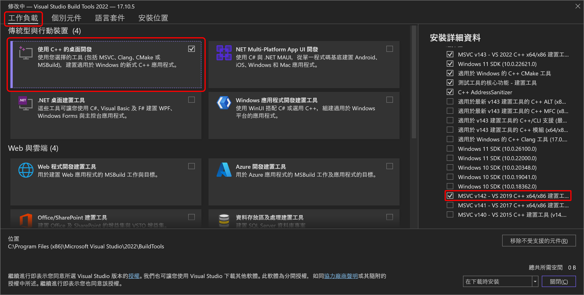
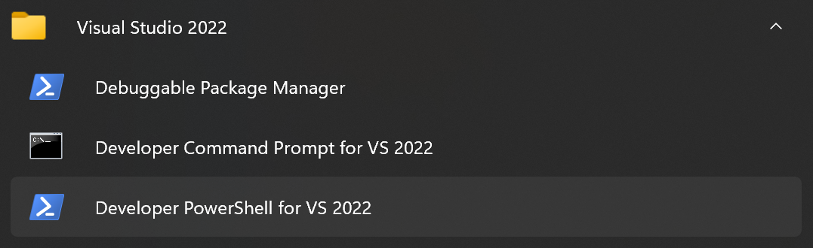
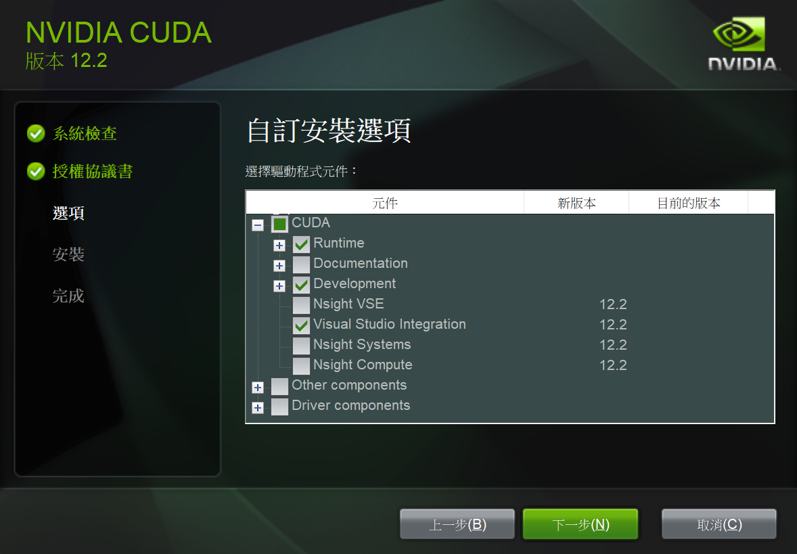
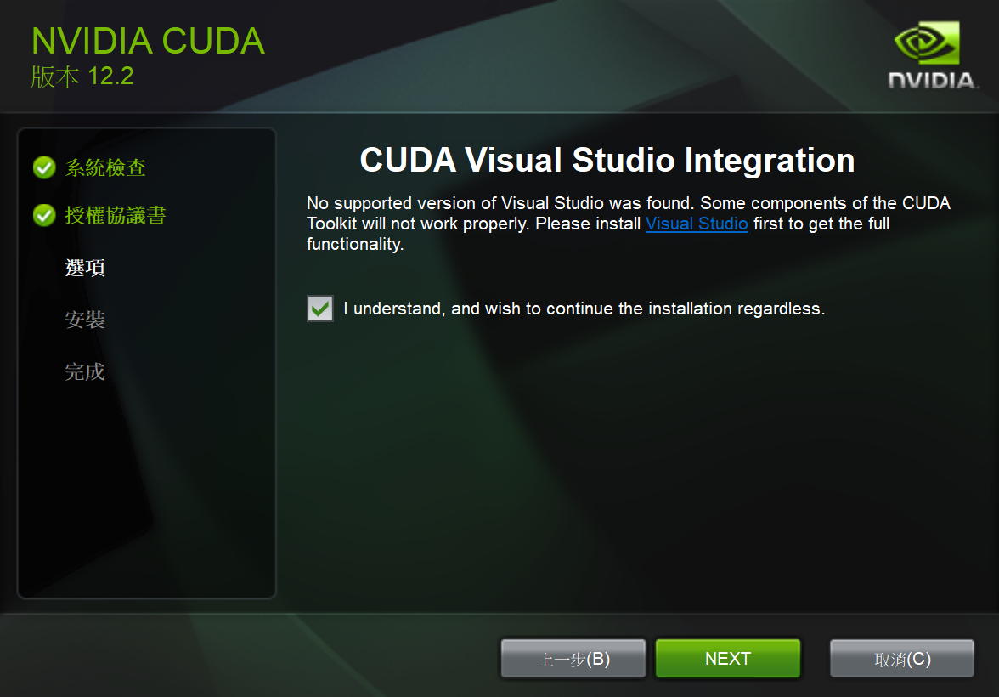
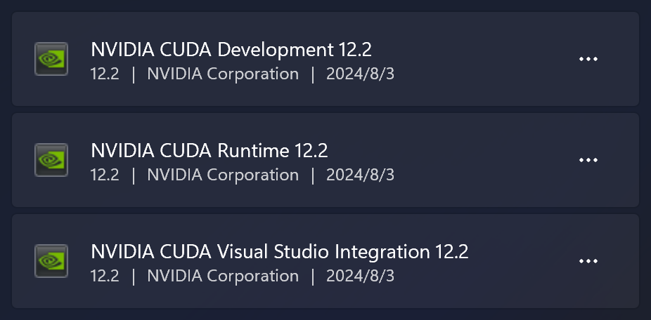

# Llama Cpp Windows Project

## Description

最近接觸到要將 LLM 放在 Windows 筆電上運行的案子，需對 llama.cpp 做一些自訂選項的編譯，因此無法直接拿 GitHub 上的 Release 來用。每次遇到這種 compile from source 的事情都弄的焦頭爛額，放在 Windows 作業系統上更是令人汗顏，深感自身學藝不精，所以多花了點心力瞭解了一下整個編譯的方法與流程，並分享一下如何走過這趟地獄之旅 👻

## Visual Studio Build Tools

CUDA 的 `nvcc` 編譯器在 Windows 上只支援 MSVC，所以用 MinGW 之類的當作編譯器是不可行的，因此勢必需要安裝 Visual Studio 的編譯器，這裡選擇用 VS Build Tools 的 CLI 來進行編譯。

通常會建議先裝 MSVC 再裝 CUDA，因為 CUDA 有些額外的 Makefile 需要放進 MSVC 的建置環境裡面，但其實 CUDA 常常抓不到 MSVC 的位置，最後還是要自己手動放。

電腦不需要有 GPU 也能編譯 CUDA 程式，我是用自己破破的小筆電來編譯，裡面並沒有 NVIDIA GPU 可以用。小筆電其實很容易編譯到過熱或者記憶體不足，但是有 GPU 的機器借來借去也是滿麻煩的，而且有 GPU 的筆電都好重 🥲

前往[下載 Visual Studio](https://visualstudio.microsoft.com/zh-hant/downloads/) > Visual Studio 工具 > Build Tools for Visual Studio 2022 下載安裝檔並執行。

安裝時選擇「使用 C++ 的桌面開發」，並額外勾選「MSVC v142 - VS 2019 C++ x64/x86 建置工具 (v14.29)」，這是為了支援 CUDA 12.2 版。



這部份的安裝內容約會用掉 8.26 GB 的硬碟空間，可以透過 Visual Studio Installer 來管理或刪掉所有東西。

安裝完成後，打開 Developer PowerShell for VS 2022 終端：



透過這個終端來打開 VS Code，就能使用 VS Build Tools 進行開發與編譯了：

```ps1
cd C:\path\to\project; code .
```

最主要需要使用 `cl` 跟 `cmake` 這兩個指令，可以測試一下他們存不存在：

```ps1
PS > cl
Microsoft (R) C/C++ Optimizing Compiler Version 19.40.33813 for x86
Copyright (C) Microsoft Corporation.  著作權所有，並保留一切權利。

使用方式: cl [ option... ] filename... [ /link linkoption... ]

PS > cmake
Usage

  cmake [options] <path-to-source>
  cmake [options] <path-to-existing-build>
  cmake [options] -S <path-to-source> -B <path-to-build>

Specify a source directory to (re-)generate a build system for it in the
current working directory.  Specify an existing build directory to
re-generate its build system.

Run 'cmake --help' for more information.
```

## CUDA Toolkit

根據 llama.cpp 的 Release 版本，這裡選擇 CUDA v12.2.0 版進行編譯。通常只需要安裝 Runtime, Development, VS Integration 就好，這些檔案約需要 3 GB 左右的硬碟空間：



如果出現以下這個畫面，代表 CUDA 找不到合適的 Visual Studio 版本，所以 VS Integration 沒辦法安裝到正確的位置：



這時要前往以下路徑，請根據自身的安裝路徑與 CUDA 版本調整：

```txt
C:\Program Files\NVIDIA GPU Computing Toolkit\CUDA\v12.2\extras\visual_studio_integration\MSBuildExtensions
```

這個資料夾裡面包含四個檔案：

```txt
CUDA 12.2.props
CUDA 12.2.targets
CUDA 12.2.xml
Nvda.Build.CudaTasks.v12.2.dll
```

把這些檔案各複製一份到以下路徑：

```txt
C:\Program Files (x86)\Microsoft Visual Studio\2022\BuildTools\MSBuild\Microsoft\VC\v160\BuildCustomizations
C:\Program Files (x86)\Microsoft Visual Studio\2022\BuildTools\MSBuild\Microsoft\VC\v170\BuildCustomizations
```

保險一點就是 v160 跟 v170 都各放一份，而且只放特定某個版本的，如果放多個版本例如 `12.2` 跟 `11.8` 同時存在之類的還是容易有問題，詳細的編譯器對應請參考 [CUDA 官方文件](https://docs.nvidia.com/cuda/cuda-installation-guide-microsoft-windows/index.html)。

如果不需要 CUDA 了，可以把以下項目刪除：



## VS Code Plugin

[C/C++ Extension Pack](https://marketplace.visualstudio.com/items?itemName=ms-vscode.cpptools-extension-pack) 包含 C & C++ 的 IntelliSense, Themes 與 CMake 支援等等，建議用 Developer PowerShell for VS 2022 打開 VSCode 再來使用這個套件，套件自動抓相關工具的路徑會抓的比較正確。

## Project Setup

將 llama.cpp 當作 git submodule 來設定：

```sh
git init
git clone https://github.com/ggerganov/llama.cpp.git llama.cpp -b b3347 --depth 1
git submodule add https://github.com/ggerganov/llama.cpp.git llama.cpp
git commit -m "add llama.cpp as submodule"
```

這裡選擇 b3347 版來編譯，因為再新一些的版本在我的電腦上會編譯到 OOM 😭

## Coding

基本上就是看著 `llama.cpp/examples/simple/simple.cpp` 來寫，實際專案其實寫了更多其他東西，但這裡只是示範用而已。

## Build

雖然 Log 有助於我們除錯，但有時實際給客戶的程式，不希望揭露太多資訊給對方，就會選擇把除錯訊息都隱藏起來。在 llama.cpp 裡面使用 `LOG_DISABLE_LOGS` 與 `NDEBUG` 兩個定義來控制除錯訊息，因此在 `CMakeLists.txt` 裡面可以這樣寫：

```cmake
add_definitions(-DLOG_DISABLE_LOGS)
add_definitions(-DNDEBUG)
```

整體上來說，`CMakeLists.txt` 其實基本上都抄 ChatGPT 的 😆

```cmake
cmake_minimum_required(VERSION 3.14)

project(hello)

set(CMAKE_CXX_STANDARD 11)
set(CMAKE_CXX_STANDARD_REQUIRED True)
set(CMAKE_POSITION_INDEPENDENT_CODE ON)
set(BUILD_SHARED_LIBS OFF)
set(CMAKE_WINDOWS_EXPORT_ALL_SYMBOLS ON)

# disable logging
add_definitions(-DLOG_DISABLE_LOGS)
add_definitions(-DNDEBUG)

add_subdirectory(llama.cpp)
include_directories(${CMAKE_CURRENT_SOURCE_DIR}/llama.cpp/include)
include_directories(${CMAKE_CURRENT_SOURCE_DIR}/llama.cpp/ggml/src)
include_directories(${CMAKE_CURRENT_SOURCE_DIR}/llama.cpp/ggml/include)
include_directories(${CMAKE_CURRENT_SOURCE_DIR}/llama.cpp/common)

add_executable(main main.cpp)
target_link_libraries(main PRIVATE llama ggml common)
```

編譯的指令相對複雜，建議寫成 PowerShell Script 來執行：

```sh
# Build.ps1

$CUDA_PATH = "C:/Program Files/NVIDIA GPU Computing Toolkit/CUDA/v12.2"
$NVCC_PATH = "$CUDA_PATH/bin/nvcc.exe"
$env:CudaToolkitDir = "$CUDA_PATH"

cmake -B build . --fresh `
    -DCMAKE_BUILD_TYPE=Release `
    -DGGML_CUDA=ON -T="v142" `
    -DCUDAToolkit_ROOT="$CUDA_PATH" `
    -DCMAKE_CUDA_COMPILER="$NVCC_PATH" `
    -DCMAKE_CUDA_ARCHITECTURES="86"
```

`CMAKE_CUDA_ARCHITECTURES` 可以指定只編譯某些 GPU 架構，藉此減小編譯執行檔或函式庫的大小，86 是 RTX 30 系列，如果是 RTX 40 系列則為 89，可以在[官方網站](https://developer.nvidia.com/cuda-gpus)查詢特定型號 GPU 的架構代號。

`-T="v142"` 用來指定 MSVC 編譯器的版本，比較新的 CUDA 可以用 v143，比較舊的 CUDA 要用 v141，但這個設定實際上到底如何辨別，其實我也不知道 😥

如果要編譯純 CPU 版本，可以設定 `-DGGML_CUDA=OFF` 來編譯，讓我們能在沒有 GPU 的機器上做點簡單測試。

筆者執行 PowerShell Script 的方式如下：

```sh
PowerShell -File Build.ps1
```

如果成功的話應該會看到以下訊息：

```txt
-- Found CUDAToolkit: C:/Program Files/NVIDIA GPU Computing Toolkit/CUDA/v12.2/include (found version "12.2.91")
-- CUDA found
-- Using CUDA architectures: 86
-- The CUDA compiler identification is NVIDIA 12.2.91
-- Detecting CUDA compiler ABI info
-- Detecting CUDA compiler ABI info - done
-- Check for working CUDA compiler: C:/Program Files/NVIDIA GPU Computing Toolkit/CUDA/v12.2/bin/nvcc.exe - skipped
-- Detecting CUDA compile features
-- Detecting CUDA compile features - done
```

以下訊息代表系統沒找到 CUDA 在哪裡，需要仔細檢查 CUDA 相關的路徑變數設定是否正確無誤：

```txt
-- Could not find nvcc, please set CUDAToolkit_ROOT.
CMake Warning at llama.cpp/ggml/src/CMakeLists.txt:352 (message):
  CUDA not found
```

還有一種問題，會噴很大量的錯誤訊息出來，其中有幾行應該會長的像這樣：

```txt
C:\Program Files\NVIDIA GPU Computing Toolkit\CUDA\v12.2\include\crt/host_config.h(157): fatal error C1189: #error: -- unsupported Microsoft Visual Studio version! Only the versions between 2017 and 2022 (inclusive) are supported! The nvcc flag '-allow-unsupported-compiler' can be used to override this version check; however, using an unsupported host compiler may cause compilation failure or incorrect run time execution.  Use at your own risk.
```

這是 `nvcc` 與 MSVC 編譯器版本對不起來的關係，需要確認官方文件，透過 `-T="v142"` 來指定正確的版本。

如果第一步設定成功了，就可以開始編譯：

```sh
cmake --build build --config Release
```

接著就看我破破的小筆電開始燃燒風扇，看編譯器熱血噴一堆 Warning 出來吧 🤣

> 編譯期間請記得幫筆電接電源線，並小心不要觸碰金屬材質的部份，避免燙傷 🔥

約莫十分鐘左右，終於編譯完成啦！但這裡編譯出來的東西，需要有 GPU 的電腦才能執行，可以另外編譯一份 CPU 版的做測試。

## Deploy

要將編譯出來的執行檔放到目標機器上執行，需要把相關的 `.dll` 檔一起放到執行目錄底下。CUDA 程式會用到的函式庫都在以下路徑：

```txt
C:\Program Files\NVIDIA GPU Computing Toolkit\CUDA\v12.2\bin\
```

參考 llama.cpp 的 Release 資訊，需要的檔案如下：

```txt
cublasLt64_12.dll
cudart64_12.dll
cublas64_12.dll
```

將這些檔案複製起來，與 `main.exe` 一起壓縮起來丟到有 GPU 的電腦裡面執行：

```sh
./main.exe model.gguf "hello, "
```

`model.gguf` 請自行準備，可以考慮使用 [TinyLlama](https://huggingface.co/TheBloke/TinyLlama-1.1B-Chat-v1.0-GGUF/tree/main) 做快速驗證。

以上大致就是如何建立一個 For Windows 的 llama.cpp 專案流程。

## License

MIT License
